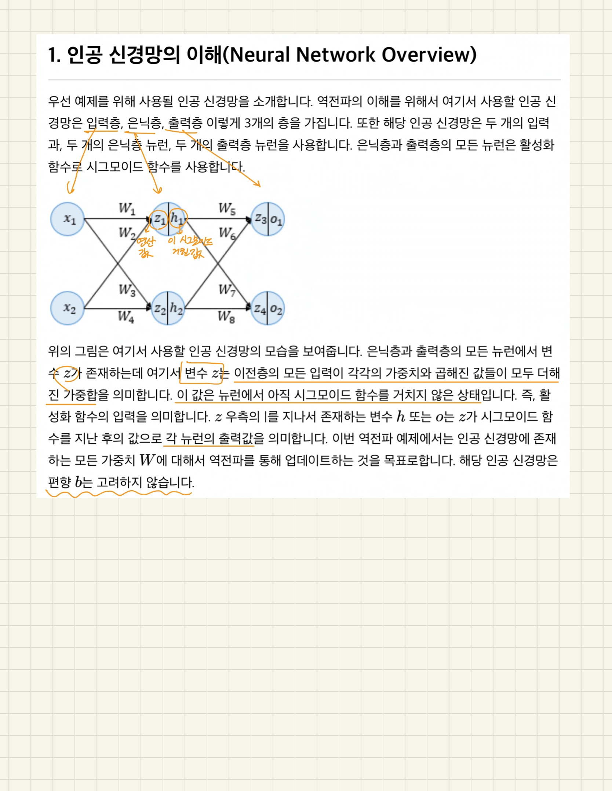
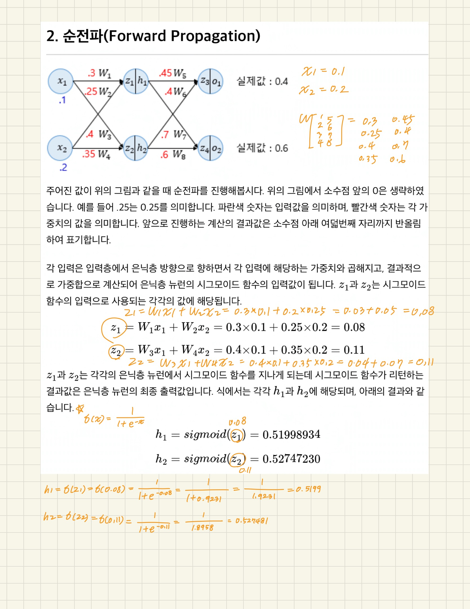
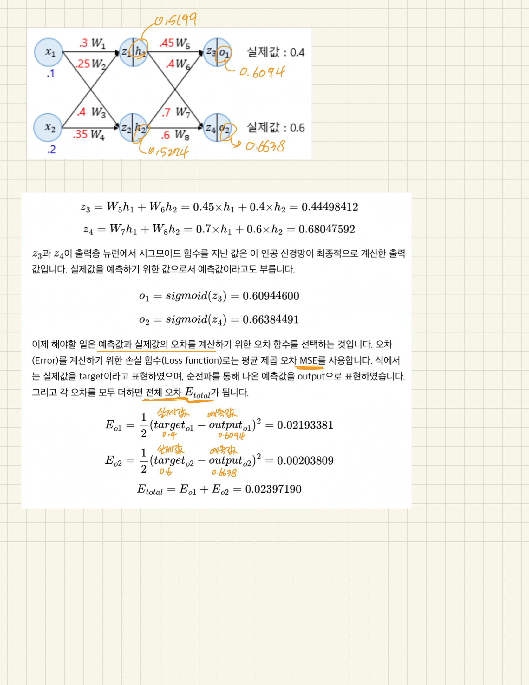

# https://wikidocs.net/60682

# https://www.youtube.com/watch?v=ZMgax46Rd3g

인공 신경망이 순전파 과정을 진행하여 예측값과 실제값의 오차를 계산하였을 때 어떻게 역전파 과정에서 경사 하강법을 사용해 가중치를 업데이트 하는지 직접 계산하여 이해해보자

### 1. 인공 신경망의 이해(Neural Network Overview)
---
  
  
  
